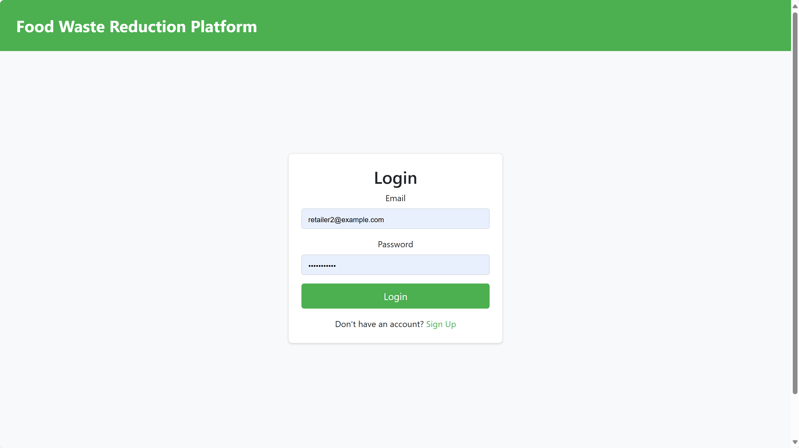

# JavaProject
AC-CST8288 TEAM PROJECT: Food Waste Reduction Website
## Versions
The first version finised at August-02-2024.
The second version begin at August-11-2024.
## Introduction

## Features
- 🔧 Fully Customizable
- 💪 Dependencies with Bootstrap
- 🌎 Tested in All Modern Browsers
- 😎 Images & FontIcons
- ⌨️ Mobile Optimization & Normal Usage
- 🔎 Funny brainstorm game
### User Registration and Authentication
- **login:** Create your Food Waste Reduction account using a username, email and password. Follow the step-by-step guide for a secure registration process.

